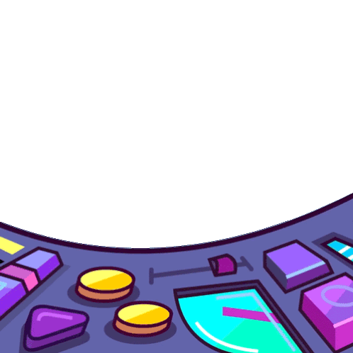
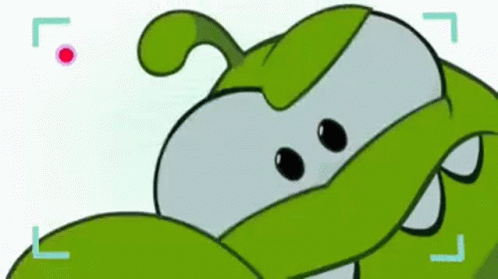
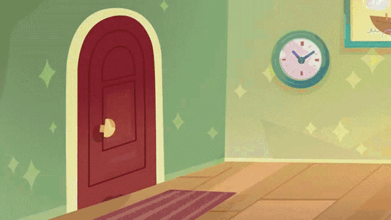

# FRAME MOTION

### Introduccion

**Motion (antes “Framer Motion style”) es una librería de animaciones para React que convierte tus `<div>`, `<button>`, etc. en componentes capaces de moverse, desvanecerse, escalar, reaccionar al scroll y a gestos, de forma muy simple y muy fluida.​**

 **Se instala con npm y se usa a través de un componente especial motion que acepta props como initial, animate, whileHover, whileInView y exit.​**


## 1) ¿Que es motion?

<div align="center">
  
</div>
<br>

**Piensa en Motion como una “caja mágica” que envuelve tus elementos de React: en vez de usar `<div>`, usas `<motion.div>`, y esa caja puede decirle al navegador “empieza invisible y luego hazte visible”, “muévete hacia la derecha”, “hazte grande al pasar el mouse”, etc.​**

**En términos simples: Convierte elementos aburridos en elementos vivos.**

**Para usarlo, primero debes instalarlo en tu proyecto**

```bash
npm install motion
```

---

## 2) La Lógica Básica

<div align="center">
  
</div>
<br>

**Para animar algo, dejamos de usar el div normal (la caja tonta) y usamos motion.div (la caja inteligente).**

**Esta caja inteligente entiende tres instrucciones principales:**

- `initial` dice “cómo empieza” el componente cuando aparece en pantalla.

- `animate` dice “a qué estado debe llegar” y Motion anima automáticamente entre ambos.

### Props clave que vas a usar mucho

- `initial`: estado inicial (por ejemplo, oculto, más pequeño, desplazado).

- `animate`: estado objetivo (visible, en su sitio, a tamaño normal).

- `transition`: estado objetivo (visible, en su sitio, a tamaño normal).

- `whileHover, whileTap`: estados mientras pasas el mouse o haces clic/toque

- `whileInView`: estado mientras el elemento está dentro del viewport (al hacer scroll)

- `exit`: cómo se anima cuando desaparece del árbol de React (se usa con AnimatePresence).

### Entendiendo los Ejes (X, Y, Z)

<div align="center">
  
</div>
<br>

**Para mover cosas, necesitas decirle hacia dónde ir. Imagina que estás sentado en tu escritorio:**

**1. Eje X (Horizontal): Es como mover tu cabeza diciendo "No".**
- x: 100 (Moverse a la derecha).
- x: -100 (Moverse a la izquierda).

**2. Eje Y (Vertical): Es como mover tu cabeza diciendo "Sí".**

- y: 100 (Moverse hacia abajo, ¡ojo! en web el positivo es abajo).

- y: -100 (Moverse hacia arriba, como un globo).

**3. Eje Z (Profundidad): Es como acercar tu cara al monitor o alejarla.**

- scale (Escala): A menudo usamos scale en lugar de Z para simular que algo se acerca o se aleja.

---

<br>

# Animar textos y cards (ejemplos prácticos)

<div align="center">
  
</div>
<br>

### Ejemplos Práctico #1

**Vamos a crear una tarjeta que, al pasar el mouse, se hace grande (como si tomara aire) y al hacer clic se encoge.**

**Usaremos los ayudantes mágicos `whileHover (mientras el mouse está encima)` y `whileTap (mientras presionas)`.​**


```jsx
import { motion } from "motion/react"

const TarjetaMagica = () => {
    return (
        <motion.div
            // Estado inicial (quieto)
            initial={{ scale: 1 }}

            // Reacción al pasar el mouse (se acerca)
            whileHover={{ scale: 1.1, rotate: 2 }}

            // Reacción al hacer clic (se presiona)
            whileTap={{ scale: 0.9 }}

            // Estilos básicos (como CSS)
            style={{
                width: 200,
                height: 200,
                backgroundColor: "red",
                borderRadius: 20,
            }}
        />
    )
}

export default TarjetaMagica
```

> Explicación: Aquí no necesitas matemáticas complejas. Solo le dices "cuando te toquen, hazte pequeño", y Motion calcula los píxeles intermedios.

- whileHover define el estado mientras el mouse está encima: un poquito más grande y con sombra, como si la levantaras con la mano.​

- Se puede usar igual para botones, imágenes, cards de testimonios, etc.​


### Ejemplos Práctico #1 v2 XD

**Piensa en una tarjeta de producto que “crece” un poco cuando pasas el mouse, como si respirara:**

```jsx
import { motion } from "motion/react";

const CardHover = () => {
    return (
        <motion.div
            className="bg-sky-700 w-39 h-50 flex justify-center items-center flex-col rounded-2xl"
            initial={{ opacity: 0, y: 30 }}
            animate={{ opacity: 1, y: 0 }}
            whileHover={{ scale: 1.05, boxShadow: "0 10px 30px rgba(0,0,0,0.15)" }}
            transition={{ duration: 0.4 }}
        >
            <h2>Producto</h2>
            <p>Descripción breve.</p>
        </motion.div>
    )
}

export default CardHover
```


<br>


### Ejemplos Práctico #2

**Imagina un título que entra como si se levantara una cortina: primero está abajo y transparente, y luego sube y aparece.**

```jsx
import { motion } from "motion/react";

const TextoH1 = () => {
    return (
        <div>
            <motion.h1
                className="font-bold text-4xl"
                initial={{ opacity: 0, y: 20 }}
                animate={{ opacity: 1, y: 0 }}
                transition={{ duration: 0.6 }}
            >
                Welcome to derry
            </motion.h1>
        </div>
    )
}

export default TextoH1
```

- opacity: 0 → 1: de invisible a visible.​
- y: 20 → 0: empieza 20 píxeles más abajo y sube hasta su sitio, como un cartel que levantas desde la mesa.​

<br>

### Ejemplos Práctico #3

**Texto que aparece letra por letra (Stagger).**
**Este es un truco avanzado de "Variantes". Imagina un coreógrafo (el padre) que le dice a los bailarines (las letras): "Salgan ustedes, pero no todos a la vez, esperen 0.1 segundos entre cada uno".**

```jsx
// 1. Definimos la coreografía (Variants)
const contenedor = {
    oculto: { opacity: 0 },
    visible: {
        opacity: 1,
        transition: {
            staggerChildren: 0.1 // El secreto: retraso entre hijos
        }
    }
}

const letra = {
    oculto: { y: 20, opacity: 0 }, // Empieza abajo e invisible
    visible: { y: 0, opacity: 1 }  // Sube y aparece
}

const LetterforLetter = () => {
    const texto = " Stephen King".split(""); // Convierte string en array
    return (
        <motion.div
            className="font-medium text-2xl"
            variants={contenedor}
            initial="oculto"
            animate="visible"
            style={{ display: "flex" }}
        >
            {texto.map((char, index) => (
                <motion.span key={index} variants={letra}>
                    {char}
                </motion.span>
            ))}
        </motion.div>
    )
}

export default LetterforLetter
```
---

<br>

## Animar cuando la sección entra en pantalla (whileInView)

<div align="center">
  
</div>
<br>

**Te pregntaras cómo activar animaciones cuando estén en la sección. Para esto usamos `whileInView` (mientras está a la vista).​**

**Imagina que es una luz automática de pasillo: solo se enciende cuando pasas por ahí.**

```jsx
'use client'
import { motion } from "motion/react"

const ScrollText = () => {
    return (
        <div>
            <motion.div
                initial={{ opacity: 0, x: -100 }} // Empieza invisible a la izquierda
                whileInView={{ opacity: 1, x: 0 }} // Al verse, aparece y va al centro
                transition={{ duration: 1 }}
                viewport={{ once: false, amount: 0.5 }} // Configuración importante
            >
                <h2
                    className="font-black text-3xl py-5"
                >¡Aparecí al hacer scroll!</h2>
            </motion.div>
        </div>
    )
}

export default ScrollText
```
> 'use client' ya que este es utilizado en nextjs y solo funciona del lado del cliente

### ¿Cómo activarla más de una vez?

**La clave está en la propiedad viewport:**

- `viewport={{ once: true }}`: La animación ocurre una sola vez y se queda así (ideal para intros).

- `viewport={{ once: false }}`: ¡Esto es lo que aplicamos! Si bajas y subes, y el elemento sale de la pantalla y vuelve a entrar, la animación se repetirá infinitamente cada vez que lo veas.

## Ejemplo 2 mas simple y detallado

**Para que un bloque se anime solo cuando el usuario hace scroll hasta él, usa initial + whileInView:**

```jsx
<motion.section
  initial={{ opacity: 0, y: 50 }}
  whileInView={{ opacity: 1, y: 0 }}
  viewport={{ once: false, amount: 0.3 }}
  transition={{ duration: 0.6 }}
>
  <h2>Sección servicios</h2>
</motion.section>
```

- `whileInView` se activa cuando la sección entra en el viewport.​

- `viewport.once`: false permite que la animación se dispare cada vez que la sección entra de nuevo en pantalla; si fuera true, solo la verías la primera vez.​

<div align="center">
  
</div>
<br>

**Piensa en una puerta automática de supermercado: si once: true, se abre solo la primera vez que entras; si once: false, se abre cada vez que alguien se acerca.**

**[Ir a leccion 2 (un poco mas avanzada)](./src/README.Md)**